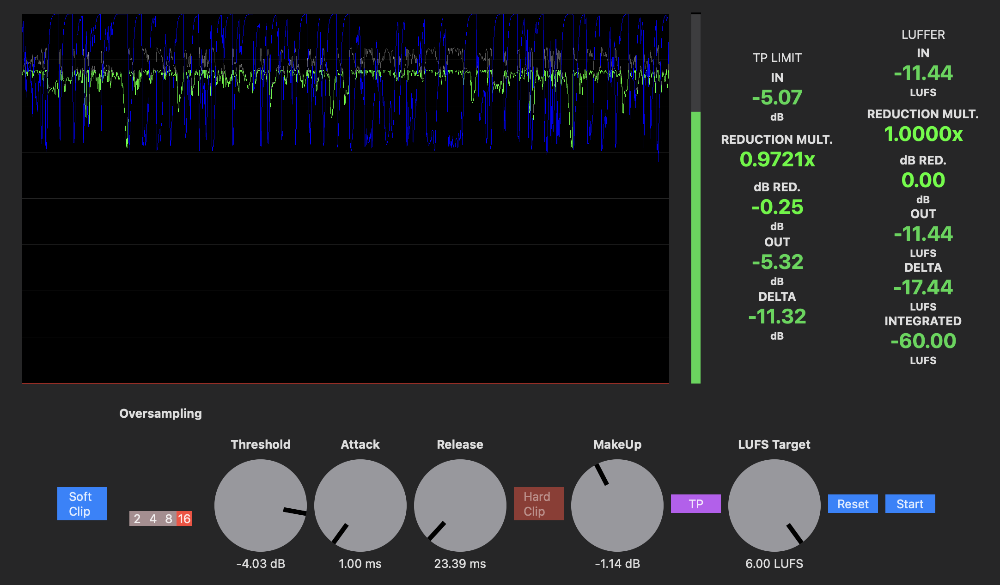
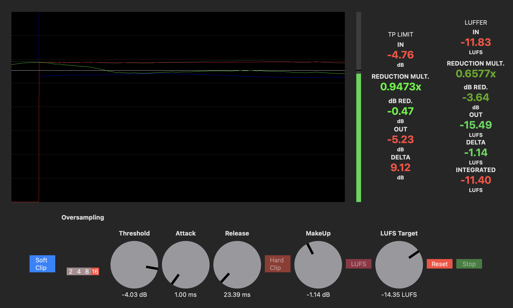

# LufsMashter Audio Unit
Free AU true peak limiting and loudness normalizing plugin for macOS. When run, it uses a host app to play an audio file specified in 
`/LufsMashter/Common/Audio/SimplePlayEngine.swift`, but it also serves as an audio unit that can be integrated into DAWs for audio processing.

## Features
### True Peak Limiter
* Optional pre limiter soft clipping at +3db from the threshold
* Oversampling at 2x/4x/8x/16x
* True peak limiting with attack and release
* Optional post limter hard clipper at the threshold

### Loudness Normalizer
* Calculates integrated LUFS(ITU-R BS.1770-5) of a recorded segment of audio 
* Applies linear gain reduction to incoming audio to match the integrated lufs to a targeted LUFS value 

### UI
* Rolling chart of true peak and LUFS measurements with a toggle to switch between views
* Measurement readouts

## Prerequisites
* Xcode (>14 recommended)
* macOS (>Monterey)
* (opt) DAW (supports AUv3 extensions)

## Installation
* Clone the repo:
```
git clone https://github.com/li-matthew/LufsMashter.git
cd LufsMashter
```

* Open the .xcodeproj file in Xcode
* Build/Run LufsMashter
* (opt) Install in a DAW:
    * Go to Product > Show Build Folder in Finder
    * Open the Debug folder
    * Copy the `.appex` file to `/Library/Audio/Plug-Ins/Components`

## Usage

* The plugin starts in the true peak limiter, with the graph representing -60dB to +6dB. The input peaks are charted in gray, the output peaks in green, and the amount of linear gain reduction in blue from ~0.0 to 1.0. The bottom row includes options to turn soft clipping on (red), select an oversampling factor, adjust the attack and release of the limiter, and to turn hard clipping on.

* Toggling the TP to LUFS changes the view to chart the LUFS from -60LUFS to +6LUFS with the same color scheme. The single parameter for this view is setting a target LUFS value. There is now a red line for the integrated LUFS. Now when using the start button to record a segment of audio, the integrated lufs for that segment of audio will begin calculating along with the linear gain reduction required to match it to the target LUFS. The gain reduction will then be applied to the incoming audio in real time, until the user presses stop, locking in the gain reduction factor. The reduction will continue to be applied until the user presses the reset button.
